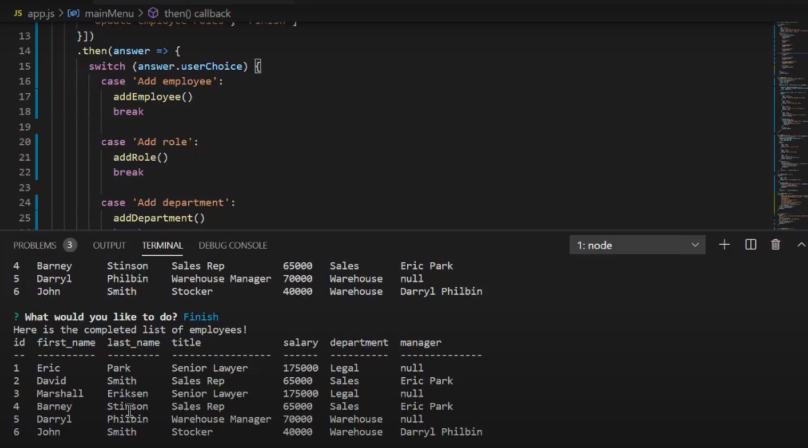

# Employee Management System

## Description 
This app uses node.js and use of mysql. The applications allows users to easily view employees in a database as well as their roles and departments they belong to. Users may also add departments, roles, and employees in addition to being able to update employee roles. 

## Installation
The repo can be found at https://github.com/E-Park8/employeemanagement. Users will have to clone the repo and run npm i in the terminal to bring in the necessary npms.

## Usage
To use this application, users will have to run node app.js in the terminal. The application will then prompt the user with eight different options depending on how they would like to interact with the database. Video demo can be found here: https://drive.google.com/file/d/1RtNSvqyojszrrkdsMe3fSJEScvD2jOXv/view